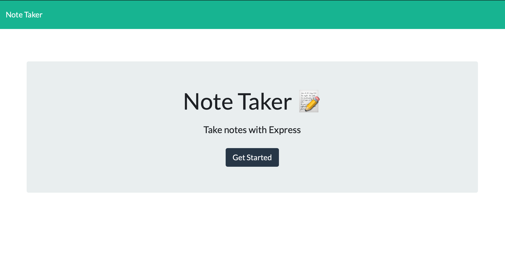

# Note Taker
An application that can be used to write, save, and delete notes. This application will use an express backend and save and retrieve note data from a JSON file.

#### Landing Page Screen Shot


#### Notes Screen Shot


---
### Table of Contents
- [Installation](#installation)
- [Usage](#usage)
- [Author Info](#author-info)
- [License](#License)
---

&nbsp;

## Installation
- Node.js
    - Install node : Nodejs.org [Download](https://nodejs.org/en/download/)

    - Install Dependencies: Inside the Project's root folder
        - ``` npm install ``` (package.json file is required in the root folder)
        
             or

        - ```npm install express ```

    - To start the server execute the following command:
        ```
        node note-taker-server.js
        ```
        type http://localhost:3001 in your browser address bar to use the app after the server starts.

&nbsp;

## Usage

Use this application to create notes that will help you organize your tasks or as reminder.

&nbsp;

## Author Info

- Linkedin -- [Amit Karmacharya](https://www.linkedin.com/in/amit-karmacharya-b344731ab/)
- Email -- amitkarmacharya.work@gmail.com

&nbsp;

## License


